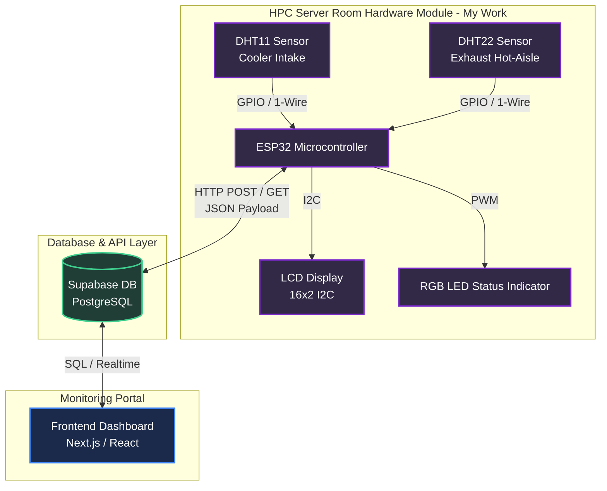

# HPC Temperature Alert System (IoT Firmware & Sensor Module)

[](https://github.com/Ferdaws-c/hpc-temperature-alert-system)
[](https://arduino.cc)
[](https://www.espressif.com/en/products/socs/esp32)
[](https://supabase.com)
[](https://ferdaws-c.github.io/portfolio/)

An enterprise-grade, fault-tolerant IoT firmware solution built to monitor environmental conditions in High-Performance Computing (HPC) server rooms. Running on an **ESP32 microcontroller**, this system integrates dual thermal sensors (Cooler Intake and Hot-Aisle Exhaust) to display local alerts, buffer offline telemetry, and sync data dynamically with a Supabase cloud database.

This project was developed as a university engineering team project. This repository specifically hosts the complete **IoT Firmware & Sensor Integration Module** which was developed entirely by **Ferdaws Qaem**.

---

## 🏛️ System Architecture

The overall system architecture is split into three main components: **Firmware & Sensors (This Repo)**, **Database (Supabase)**, and the **Frontend Web Dashboard**.



---

## 🛠️ Hardware Specification

*   **Microcontroller:** ESP32 (NodeMCU-32S)
*   **Intake Sensor:** DHT11 temperature & humidity sensor (range: 0–50°C, accuracy: ±2°C)
*   **Exhaust Sensor:** DHT22 temperature & humidity sensor (range: -40–80°C, accuracy: ±0.5°C)
*   **Local Display:** 16x2 Liquid Crystal Display (LCD) with I2C module (PCF8574)
*   **Visual Alert System:** Common-Cathode RGB LED (using PWM pulse-width modulation for color mixing)
*   **Network:** On-board Wi-Fi (supporting standard WPA2 Personal & WPA2 Enterprise protocols)

---

## 💡 Key Firmware Features (My Role)

I was individually responsible for designing, coding, and testing the system firmware. The codebase addresses critical embedded system challenges:

### 1. Robust Network & API Fault Tolerance
In mission-critical server environments, network drops must not lead to data loss.
*   **Ring Buffer Caching:** Uses a local memory buffer to store sensor readings during Wi-Fi or server downtime. Once the connection is re-established, the firmware flushes the cached logs to Supabase chronologically.
*   **Exponential Backoff Reconnection:** If the Wi-Fi connection drops, the firmware uses a non-blocking retry algorithm with exponential backoff (starting at 2s up to 64s) to reconnect without halting sensor readings or LCD refreshes.
*   **HTTP Retry Strategy:** Similar exponential backoff for HTTP POST failures to avoid overwhelming the network.

### 2. Dynamic Threshold Configuration
Instead of hardcoding safety thresholds (which would require re-flashing the firmware to change), the code fetches temperature safety bounds dynamically from a Supabase table every 30 seconds.
*   **Warning Thresholds:** Dynamically fetched values for `warning_min` (cold warning) and `warning_max` (hot warning).
*   **Visual Mapping:** The local RGB LED automatically shifts colors and blinks based on these dynamic parameters (Green = Safe, Orange = Warning, Blinking Red = Critical/Alert).

### 3. Non-Blocking Multitasking Architecture
Standard Arduino `delay()` blocks the CPU, preventing simultaneous tasks. I built this firmware using a state-machine style `millis()` timing approach.
*   **Tasks executed concurrently:**
    *   Sensor reading (every 2s)
    *   LCD screen updates (every 2s)
    *   API sync / cached buffer flush (every 10s)
    *   Dynamic threshold fetching (every 30s)
    *   Emergency LED warning indicator blinking (every 500ms)

---

## 📋 Code Directory Structure

```directory
hpc-temperature-alert-system/
├── src/
│   ├── Main/
│   │   ├── Main.ino         # Production firmware (WPA2 Enterprise / Campus setup)
│   │   └── wifi_config.h    # Config template for WPA2 Enterprise
│   └── Demo/
│       ├── Demo.ino         # Lab/Home firmware (WPA2 Personal setup)
│       └── wifi_config.h    # Config template for WPA2 Personal
├── docs/
│   ├── Hardware_Module_SRS_Document.docx  # Detail on hardware logic (My individual work)
│   └── reference/
│       ├── SRS_Group_9.docx # Full Software Requirements Specification (Team document)
│       └── IEEE.docx        # Full IEEE-formatted Project Report (Team document)
├── CONTRIBUTION.md          # Clear description of Ferdaws' role vs. Team role
└── README.md                # Project overview and specifications
```

---

## 🚀 Setup & Installation

To run this firmware locally, you will need the Arduino IDE or PlatformIO set up with the ESP32 Core.

### 1. Library Dependencies
Install the following libraries through the Arduino Library Manager:
*   `DHT sensor library` (by Adafruit)
*   `LiquidCrystal_I2C` (by Frank de Brabander)
*   `ArduinoJson` (by Benoit Blanchon)
*   `Adafruit Unified Sensor` (helper dependency for DHT)

### 2. Configuration (`wifi_config.h`)
Rename or edit `wifi_config.h` in either the `Main` or `Demo` folder and supply your Wi-Fi credentials:

```cpp
#ifndef WIFI_CONFIG_H
#define WIFI_CONFIG_H

// WPA2 Personal Setup (Demo Folder)
const char* WIFI_SSID     = "YOUR_WIFI_SSID";
const char* WIFI_PASSWORD = "YOUR_WIFI_PASSWORD";

#endif
```

If utilizing the `Main` production version (which supports WPA2 Enterprise networks, e.g., university Wi-Fi):
```cpp
#ifndef WIFI_CONFIG_H
#define WIFI_CONFIG_H

// WPA2 Enterprise Setup (Main Folder)
const char* WIFI_SSID     = "STUDENT_SSID";
const char* WIFI_USERNAME = "STUDENT_ID";
const char* WIFI_PASSWORD = "STUDENT_PASSWORD";

#endif
```

### 3. API & Database Settings
Locate the Supabase config variables in `Main.ino` or `Demo.ino`:
```cpp
const char* SUPABASE_URL    = "https://your-project.supabase.co/rest/v1/sensor_readings";
const char* SUPABASE_APIKEY = "YOUR_ANON_PUBLIC_KEY";
```
Replace them with your own Supabase project endpoint credentials.

---

## 🤝 Contribution & Team Context

This system was designed as part of a university team project. While the entire project contains databases, web dashboards, and overall documentation, **this repository focuses solely on the hardware sensor module and firmware designed and written by Ferdaws Qaem**.

For details on the collaborative work boundaries, please refer to [CONTRIBUTION.md](file:///d:/antigravity%20Projects/hpc-temperature-alert-system/CONTRIBUTION.md).

---

## 📜 License

This project is licensed under the MIT License. Feel free to use and modify it for educational or personal projects!
